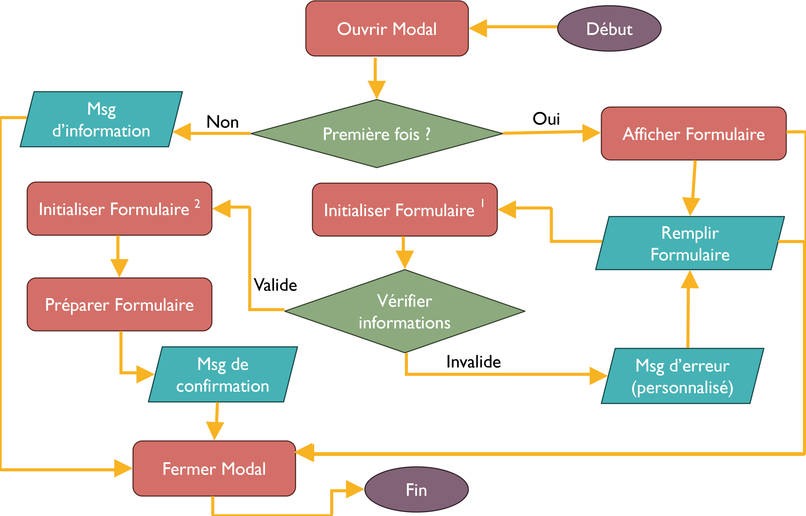
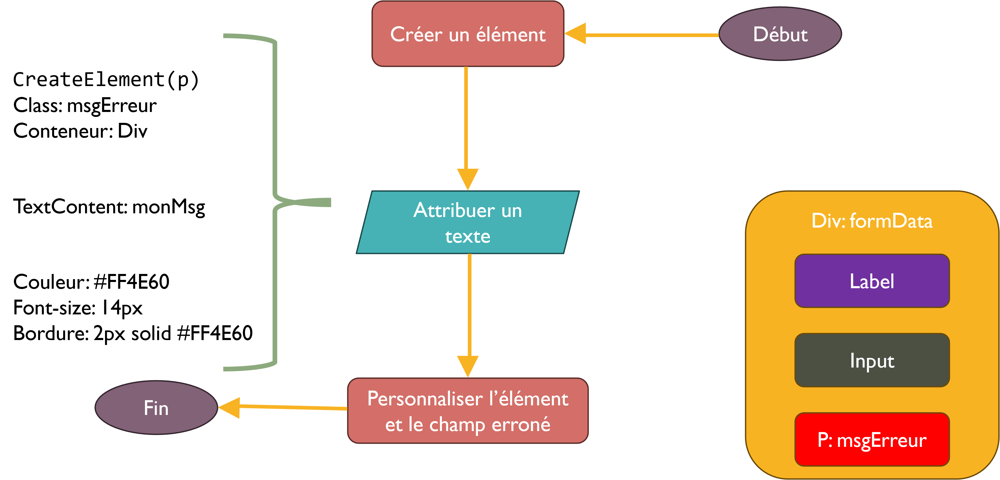
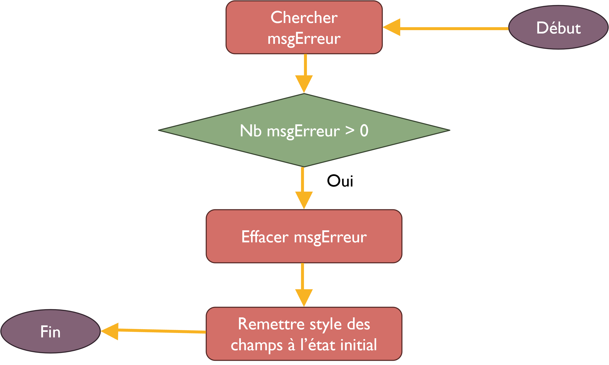
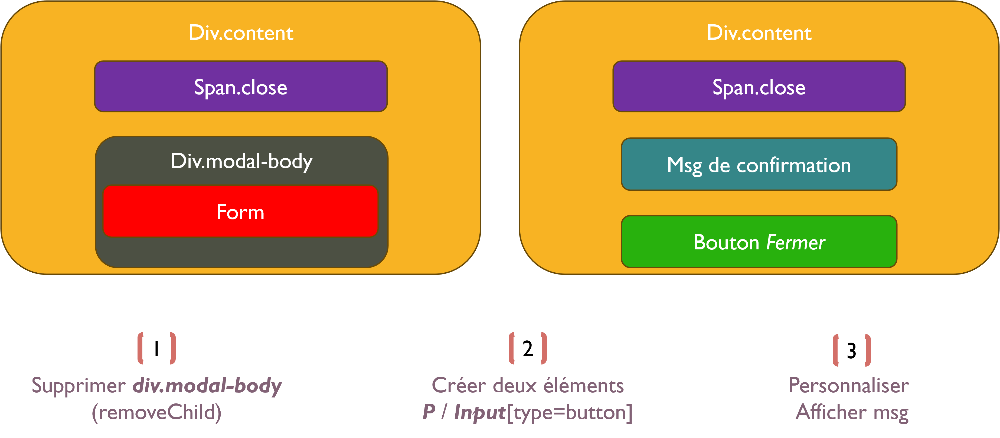

# Projet GameOn

**1. But de projet GAMEON**
GameOn est une entreprise spécialisée dans l’organisation de conférences et de concours de jeux.
Leurs développeurs travaillent actuellement sur une nouvelle page d'accueil ainsi que sur le processus d'inscription aux concours, incluant un modal pour le formulaire d’inscription.
Ils ont déjà entamé la mise en place de la structure HTML, du style CSS et une première partie du JavaScript pour lancer la maquette.
Mon rôle consiste à implémenter et compléter le code JavaScript manquant.

**2. Bonnes pratiques de structuration et d'organisation du code**
J'ai adopté une méthodologie pour la structuration du code, j'ai opté pour une séparation claire entre le code HTML, le CSS et le JavaScript, chacun dans des fichiers dédiés. Cette approche assure une organisation optimale et facilite la maintenance.
De plus, j'ai ajouter des commentaires explicatifs dans le code pour favoriser sa compréhension, encourageant ainsi la collaboration au sein de l'équipe et simplifiant les tâches de maintenance.
j'ai privilégé également la modularité en utilisant de petites fonctions à des fins spécifiques, évitant ainsi toute surcharge inutile et garantissant une lisibilité accrue et une réutilisabilité efficace du code.
Enfin, chaque segment du code subit des tests manuels rigoureux avant son intégration, assurant ainsi la qualité et la fiabilité de mon produit final.

**3.Algorithme général:**

**4. Algorithme de message d’erreur personnalisé**

**5. Algorithme d'initialiser le formulaire (1)**

**6. Algorithme d'initialiser le formulaire (2)**

**7. Validation des informations**
Dans mon code, j'ai développé des fonctions de vérification pour chaque type d'élément input.
Chaque fonction est nommée selon le format 'verifier' suivi du type de l'élément avec la première lettre en majuscule, par exemple, 'verifierText()' pour vérifier la valeur d'un input de type texte.
Pour gérer ces vérifications de manière dynamique, j'ai créé une fonction appelée 'validation'. Cette dernière construit le nom de la fonction de vérification en fonction du type de l'input, vérifie ensuite si cette fonction existe, puis l'appelle pour effectuer la validation correspondante.

**8. Contraintes**
Tous les champs doivent être remplis
Nom et prénom doivent contenir au moins 2 caractères
L’email doit respecter le format d’un email
L’utilisateur doit avoir au moins 15 ans pour pouvoir participer
Le nombre de tournois doit être positive
L’utilisateur doit sélectionner un tournois
L’utilisateur doit accepter les termes et les conditions.

**9. Vérification de l’email**
Le format d’un email acceptable est: /^\w+([\.-]?\w+)*@\w+([\.-]?\w+)*(\.\w{2,3})+$/

**10. Modification l’Apparence de Modal**

    if (window.matchMedia("(max-width: 768px)").matches) {
        //Si la largeur d'écran est inférieure à 768px
    
        if(modalbg.style.display !== "none"){
           //Si le modal est affiché
           //Traitement à faire
        }
        else
        { //Remettre à l’état initial }
    }

Vérifier l'état de media query toutes les 100 ms: `setInterval(gererChangementResponsive, 100);`
